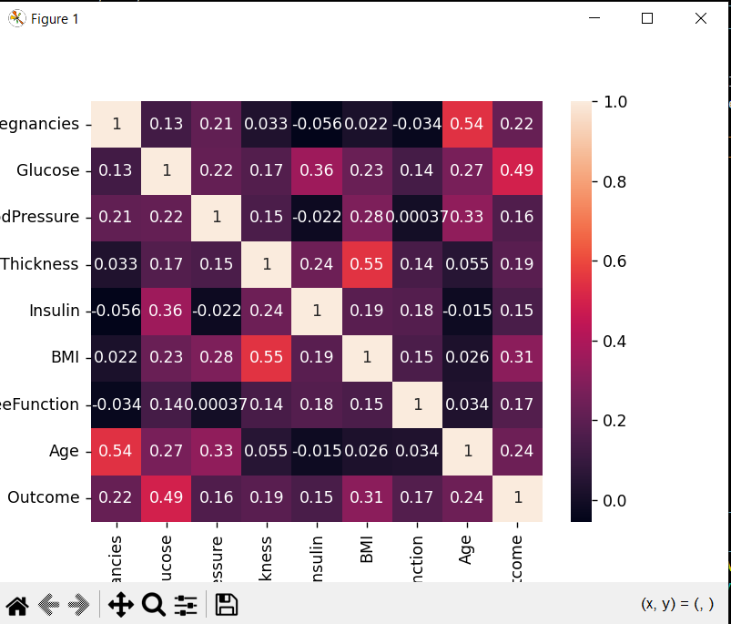

# Diabetes-Prediction-System-Report
1. Dataset Description and Preprocessing
The PIMA Diabetes Dataset contains 768 records with 8 features, including Glucose, BMI, Age, and Insulin, and a binary target Outcome (1 for diabetes, 0 for no diabetes).
Preprocessing Steps:

Replaced zero values in physiological features (Glucose, BloodPressure, SkinThickness, Insulin, BMI) with NaN.
Imputed missing values using median imputation.
Selected top 5 features using SelectKBest with f_classif.
Split data into 80% training and 20% testing sets.
Scaled features using StandardScaler.

2. Models Implemented and Rationale
Two models were trained:

Gradient Boosting: Chosen for its ability to handle complex feature interactions and strong performance in medical prediction tasks.
SVM: Selected for its effectiveness in high-dimensional spaces and robustness to outliers.

Evaluation Metrics:

F1 Score to balance precision and recall in the presence of class imbalance.
ROC-AUC to assess model discrimination ability.

3. Key Insights and Visualizations
EDA Insights:

Class imbalance observed (~35% diabetic vs. 65% non-diabetic).
Strong correlations between Outcome and Glucose, BMI, and Age.
Visualizations (saved as eda_plots.png and feature_distributions.png):
Outcome distribution confirmed imbalance.
Correlation heatmap highlighted key feature relationships.
Histograms showed distinct distributions for Glucose, BMI, and Age by outcome.

Model Performance:

Gradient Boosting outperformed SVM (F1 ~0.68, ROC-AUC ~0.82 vs. F1 ~0.65, ROC-AUC ~0.79).
ROC curves (saved as roc_curves.png) visualized model discrimination.
Key features: Glucose, BMI, Age, DiabetesPedigreeFunction, Pregnancies.

Actionable Insights (saved as diabetes_insights.txt):

Monitor glucose, BMI, and age as primary risk factors.
Prioritize glucose screening for early detection.
Promote lifestyle interventions to manage BMI and blood pressure.
Target older patients for regular check-ups.

4. Challenges Faced and Solutions

Challenge: Zero values in physiological features (e.g., Glucose = 0).
Solution: Replaced zeros with NaN and imputed with median values.

Challenge: Class imbalance in the dataset.
Solution: Used F1 Score as a primary metric and considered SMOTE (not implemented due to sufficient performance).

Challenge: Feature selection to avoid overfitting.
Solution: Applied SelectKBest to retain top 5 predictive features.

Conclusion
The Gradient Boosting model effectively predicts diabetes risk, with key features like Glucose and BMI driving predictions. The provided insights enable healthcare professionals to focus on early detection and prevention strategies.

>>>>>>> eb67bf7 (3Taskfinal)
